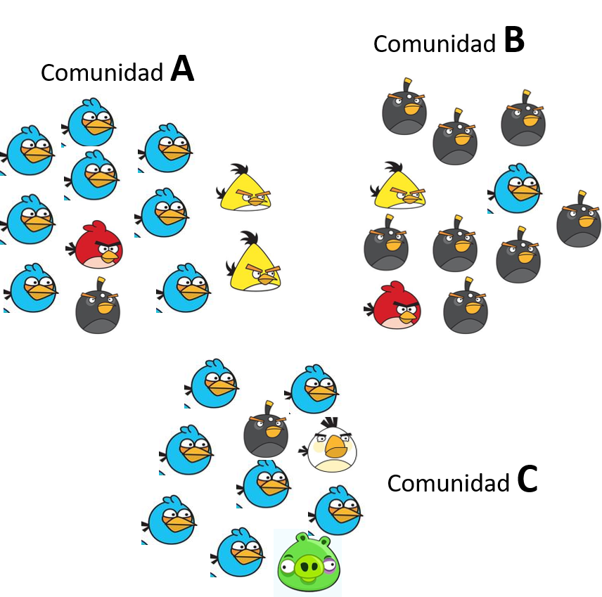

class: center

background-image: url("Imagenes/AB2_0102.jpg") 
background-position: center
background-size: contain

# Similitud de comunidades
### Carlos Ivan Espinosa
#### enero de 2022

---
class: inverse, center, middle

# Introducción

--
La composición y estructura de la comunidad varía a lo largo de los gradientes ambientales como consecuencias de cambio en la tolerancia de las especies.

--
<br></br>
Esto produce cambios en la composición de la comunidad (las especies que la constituyen) y en la estructura (las abundancias de las especies)


---
## ¿Cómo podemos diferenciar las comunidades a la largo de un gradiente?

--

```{r com, echo=FALSE, fig.cap = "Ejemplo de la variación de una comunidad", fig.align='center'}
set.seed(3)
com <- matrix(c(rnorm(1000, 20, 5), rnorm(1000, 10, 3),
                rnorm(1000, 30, 7), rnorm(1000, 20, 8),
                rnorm(1000, 35, 8)), 1000, 5)
colnames(com) <- letters[1:5]

plot(density(com[,"a"]),main = "", xlab="Gradiente", ylim=c(0, 0.2), xlim=c(0,50), lwd=1.3)
lines(density(com[,"b"]), col="red", lwd=1.3)
lines(density(com[,"c"]), col="blue", lwd=1.3)
lines(density(com[,"d"]), col="green", lwd=1.3)
lines(density(com[,"e"]), col=5, lwd=1.3)

abline(v=seq(5,45, by=10), lty=1, lwd=20, col=rgb(0,0,0,0.3))
text(seq(5,45, by=10),rep(0.20, 5),LETTERS[1:5], cex=1.5, font=2, col="white")

```
---

# Parece sencillo, tenemos un gradiente muy claro

#### Pero, ¿qué pasa cuando tenemos un gradiente no tan claro?

--
class: center


---

# Cuanto se parecen dos comunidades

Dos elementos se parecen más cuando sus propiedades son más parecidas.

--

.pull-left[



]

--

.pull-right[ 

<br></br>

## ¿Qué comunidad es más parecida? 

El cálculo de _similitud_ nos permite _cuantificar_ en qué medida dos comunidades se parecen. 

]

---
# Medidas distintas

--
.pull-left[ 

### Comparación entre dos comunidades

__Similitud__: cuanto se parecen dos comunidades entres si. Se puede calcular basado en presencia ausencia o en abundancia.

$$A - B$$
$$B - C$$
]

.pull_right[


### Comparación entre mas de dos comunidades

Cuán lejanas se encuentran las comunidades entre ellas, distancias relativas vistas en conjunto. Se puede calcular basado en  __Distancias__ o en __Disimilitud__

$$A-B-C$$

]

---
class: inverse, center, middle

# Índices de Similitud 

Los índices de similitud nos permiten cuantificar cuanto se parecen dos comunidades entre sí. Estos índices se pueden calcular basados en incidencia (presencia-ausencia de especies) (ej. Índices de *Sorensen*, *Jaccard* y *Simpson*), y basados en la abundancia, *Porcentaje de Similitud*.


---

# Entendiendo la similitud

Imaginemos que tenemos cuatro localidades (A, B, C, D) con cuatro especies; *Tabebuia billbergii*, *Geoffroea spinosa*,*Ceiba trichistandra* y *Colicodendron scabridum*. 


```{r echo=FALSE}
dens <- data.frame(T.bil = c(1, 1, 2, 3), G.spi = c(21, 8, 13, 5),
                   C.tri = c(11, 3, 7, 5), C.sca = c(16, 0, 9, 4))
row.names(dens) <- LETTERS[1:4]
```

Generamos un gráfico basado en las dos primeras especies para ver cuánto se parece cada sitio.

.pull-left[ 

```{r echo=FALSE, fig.cap = "Similitud de cuatro localidades hipotéticas",  fig.height=4, fig.width=4, fig.align='center'}
par(mar=c(4,4,1,1), mgp=c(1,0.3,0), tcl= -0.2)
plot(dens[,1:2], type = "n", cex.axis=0.8, xlim=c(0,20), ylim=c(0,25)) 
text(dens[,1:2], row.names(dens), col ="blue")
```
]

--
.pull-right[

Cada especie es una variable que nos ayuda a definir cuanto se parecen las comunidades

]

---

# Índices cualitativos 

Los índices de incidencia estan basados en presencia-ausencia de especies. A continuación veremos tres diferentes índices:

--
> <small>$$S_s= \frac{(2c)}{(a+b+2c)}$$
    Índice de Sorensen</small>
>    
>   <small>$$S_s= \frac{(c)}{(a+b+c)}$$
    Índice de Jaccard</small>
>    
>   <small>$$S_s= \frac{(c)}{c+min(a+b)}$$
    Índice de Simpson</small>

--

Donde *c* es el número de especies en común entre los dos sitios, *a* y *b* son el número de especies únicas en cada sitio.

---
# Calculando los índices


.pull-left[ 

```{r }
comp <- dens
comp[comp>0] <- 1 #Generamos una matriz de presencia ausencia
comp

a <- sum(colSums(comp[1:2,])==1&comp[2,]==0)#Ocurren en A pero no en B
b <- sum(colSums(comp[1:2,])==1&comp[1,]==0)#Ocurren en B pero no en A
c <- sum(colSums(comp[1:2,])==2) #ocurren en A y B

```
]

.pull-right[

```{r}
Sor <- (2*c)/(a+b+(2*c))
Jac <- c/(a+b+c)
Sim <- c/c+min(a,b)

Sor; Jac; Sim
```
]

---

# Índices cuantitativos

El *porcentaje de similitud* es la versión cuantitativa del índice de Sorensen. Este índice está basado en datos de abundancia y es calculado como:

--

>   <small>$$S_s= \frac{(2W)}{A+B}$$
    Porcentaje de Similitud</small>
    
--


Donde; _W_ es la sumatoria del valor mínimo de la abundancia entre las comunidades comparadas para cada especie. _A_  y _B_ es la suma de las abundancias de todas las especies en cada sitio. 

---

#Calculando los índices

```{r, echo=FALSE, message=FALSE}
library(knitr)

MatPS <- rbind(dens[1:2,], apply(dens[1:2, ], 2, min))#Obtenemos el valor mínimo de cada especie
MatPS <- data.frame(MatPS, Medidas=rowSums(MatPS), Tipo= c("A", "B", "W")) #Obtenemos W,A,B

kable(MatPS, caption = "Medidas para obtener el porcentaje de Similitud", row.names = FALSE)
```

--

Ahora, obtenemos el porcentaje de similitud

```{r}
PS <- (2*MatPS[3,5])/(MatPS[1,5]+MatPS[2,5])
PS
```

---
class: inverse, center, middle

# Distancias entre sitios

Las distancias entre sitios es la cara opuesta de la similitud, en este caso valores más altos de distancia implica que las comunidades son más diferentes entre sí. Normalmente las distancias son utilizadas para comparar múltiples comunidades a la vez. 

---

# Tipos de distancias

Existen dos tipos de distancias, que se diferencian por como se calculan las distancias.

--

- __Disimilitud:__ son distancias calculadas a partir de los índices de similitud usualmente como:
$$D = 1-Similitud. $$
--

- __Distancias:__ aquellas que no tienen medidas de similitud análogas, algunos de estos índices son; Euclidiana, Chord, Hellinger.


---
# Distancia Euclidiana

 La distancia euclidiana entre dos sitios es la longitud del vector que conecta los sitios y la podemos obtener como 
 
 $$\sqrt{x^2+y^2}$$
 
Donde *"x"* y *"y"* son las coordenadas (x, y) de distancia entre un par de sitios.

.pull-left[

```{r}
dens
```

La distancia en cada eje es la diferencia en la abundancia de cada especie entre el sitio B y C.

]

.pull-right[

```{r}
x <- dens[2, 1] - dens[3, 1]
x
```

```{r}
y <- dens[2, 2] - dens[3, 2]
y
```


```{r}
sqrt(x^2 + y^2)
```
]


---
## Efecto de doble-ceros y abundancia

Aunque la distancia Euclidiana es fácilmente interpretable, pero esta fuertemente impactada por los dobles ceros

 
```{r, echo=FALSE}
dcMat <- data.frame(spp1=c(1,0,0),spp2=c(1,1,0),
                    spp3=c(0,1,0),sp4=c(0,1,0),
                    spp5=c(0,1,1), spp6=c(0,0,1))
rownames(dcMat) <- LETTERS[1:3]

kable(dcMat, caption = "Efecto del doble cero")

```

--

Estos datos nos muestran un claro gradiente. Desde el punto de vista biológico espararíamos que las distancias sean:

$$ A-B-C$$
---

# Calculando la distancia

Los índices deberían permitir recuperar ese gradiente, veamos lo que pasa.

```{r , message= FALSE}
library(vegan)
vegdist(dcMat, "euclidean")
```

--

El doble cero de la comunidad A y C generan una mayor similitud, de esta forma, las tres comunidades son mostradas a igual distancia.


---

# El doble cero es informativo o no


--

.pull-left[ 

### Cero no informativo 

Datos biológicos, el cero puede deberse a: que aunque la especie ocurre en ese lugar no pudo ser muestreada, o no ocurre en ese lugar por restricciones abióticas. 

]

--

.pull-right[ 

### Cero informativo 

En  datos abióticos el cero implica la ausencia de algo, por ejemplo tener cero mg de un contaminante es una información. 
]

---

# Efecto de la abundancia

La distancia euclidiana es fuertemente impactada por la diferencia de abundancias. El cálculo de esta distancia eleva al cuadrado las abundancias, incrementando el efecto de las especies dominantes. 

Veamos a qué nos referimos en el siguiente ejemplo.

```{r, echo = FALSE}
dcMat2 <- data.frame(spp1=c(0,1,0),spp2=c(1,0,8),
                    spp3=c(1,0,7))

rownames(dcMat2) <- LETTERS[1:3]

kable(dcMat2, caption = "Efecto de la abundancia")
```

--

Esperaríamos que las comunidades A y C esten aproximadamente a la misma distancia de B.


---

# Calculemos las distancias


```{r, echo = FALSE}
dcMat2 <- data.frame(spp1=c(0,1,0),spp2=c(1,0,8),
                    spp3=c(1,0,7))

rownames(dcMat2) <- LETTERS[1:3]

kable(dcMat2, caption = "Efecto de la abundancia")
```


```{r}
vegdist(dcMat2, "euclidean")
```

La comunidad C es muy distinta a las demás.

---
# Distancia Bray-Curtis

En ecología una de las distancias más utilizada es la de *Bray-Curtis*, esta distancia es el opuesto del porcentaje de similitud. Es calculada como:

$$D_{BC} = \sum_{i=l}^R \frac{(x_{ai} - x_{bi})}{(x_{ai} + x_{bi})}$$
La distancia *Bray-Curtis* se refiere a la diferencia total en la abundancia de especies entre dos sitios, dividido para la abundancia total en cada sitio. 
---

# Representación gráfica

Como se había comentado, es virtualmente imposible representar una distancia en más de tres dimensiones (cada especie es una dimensión). 

Una forma sencilla de mostrar distancias para tres o más especies es crear un gráfico de dos dimensiones, intentando organizar todos los sitios para que las distancias sean aproximadamente las correctas. 

```{r echo = FALSE, warning=FALSE, message=FALSE, cache.comments=FALSE, fig.height=6.5, fig.width=3.5}

library(vegan) 

#Distancia Euclidiana
mdsE <- metaMDS(dcMat2, distance = "euc", autotransform = FALSE, trace = 0) 
#Distancia de Bray-Curtis
mdsB <- metaMDS(dcMat2, distance = "bray", autotransform = FALSE, trace = 0) 

```

```{r bray, echo = FALSE, fig.cap = "Arreglo de las parcelas en distancias multidimensionales no métricas (NMDS). Estas dos figuras muestran los mismos datos en bruto, pero las distancias euclidianas tienden a enfatizar las diferencias debidas a las especies más abundantes, mientras que Bray-Curtis no lo hace.", warning=FALSE, fig.height=5.5, fig.width=8.5}

par(mfcol=c(1,2), oma=c(1,1,1,1), mar=c(4,4,1,1),
    mgp=c(1,0.3,0), tcl= -0.2)

plot(mdsE, display = "sites", 
     type = "text",main="a)Euclidiana", 
     cex.axis= 1, cex.main=1, cex.lab=1, cex = 2)

plot(mdsB, display = "sites", type = "text", 
     main="b)Bray-Curtis", 
     cex.axis= 1, cex.main=1, cex.lab=1, cex = 2)
```
 

---

# Transformación y Estandarización de datos

Cuando trabajamos con datos multivariantes cabe la posibilidad de que los datos dentro de esta matriz tengan diferencias de magnitud importantes. Como vimos antes, el cálculo de distancia entre los sitios puede verse fuertemente afectado por la magnitud de sus diferencias.

En el ejemplo que mostramos en el inicio, las similitudes entre comunidades basadas en las dos primeras especies, las diferencias dependen de la escala de medición (los valores de los ejes), y sobre cómo medimos la distancia a través del espacio multivariado [@Stevens2009].

De esta forma, las diferencias entre sitios son dependientes de la abundancia de cada especie. En el caso de *G. spinosa* su eje varía entre 5 y 21, mientras que para *T. billbergii* varía entre 1 y 3 (Figura \@ref(fig:NMDS2)a). Veamos ahora que sucede con las similitud si incremento la abundancia de *T. billbergii* (Figura \@ref(fig:NMDS2)b).

```{r NMDS2, fig.cap = "Distancias de cuatro localidades hipotéticas",  fig.height=3}
par(mar=c(4,4,1,1), mgp=c(1,0.3,0), mfcol=c(1,2), tcl= -0.2)
dens1 <- dens
dens1$T.bil <- dens1$T.bil*100
plot(dens[,1:2], type = "n", cex.axis=0.8, xlim=c(0,30), ylim=c(0,30), main="a.") 
text(dens[,1:2], row.names(dens), col ="blue")

plot(dens1[,1:2], type = "n", cex.axis=0.8, ylim=c(0,300), main="b.") 
text(dens1[,1:2], row.names(dens1), col ="blue")
```

Como vemos en la figura \@ref(fig:NMDS2) las distancias entre cada uno de los sitios cambio cuando incremento la abundancia de _T. bilbergi_, aunque este incremento fue proporcional.  Una forma de corregir esta distorsión es calcular la densidad relativa de cada especie, de esta forma cada especie variará entre 0 y 1 [@Stevens2009]. Cuando nos referimos a densidad relativa hablamos de la densidad de una especie con referencia a algo, en este caso con relación a la abundancia de individuos de la misma especie en otros sitios.

Para calcular la densidad relativa dividimos la abundancia de cada especie para la suma total de los individuos de las especies en esa muestra.

```{r}
dens[,1]/sum(dens[,1])
dens1[,1]/sum(dens1[,1])
```

---

Ahora podemos ver cómo *T. billbergii* varía en su abundancia en los cuatro sitios. Los sitios A y B tienen el 14% de individuos mientras que el D tiene el 42% de los individuos de esta especie. Interesantemente, no hay diferencias en las proporciones entre las dos medidas que tenemos. ¿Qué pasó con las distancias?


```{r NMDS3, fig.cap = "Distancias de cuatro localidades hipotéticas",  fig.height=3.5, fig.width=5, echo=FALSE}

dens3 <- dens[,1:2]

for(i in 1:2){
dens3[,i] <- dens[,i]/sum(dens[,i])
}
dens4 <- dens1[,1:2]

for(i in 1:2){
dens4[,i] <- dens1[,i]/sum(dens1[,i])
}

par(mfcol=c(2,2), mar=c(4,4,1,1), mgp=c(1,0.3,0), tcl= -0.2)
plot(dens[,1:2], type = "n", cex.axis=0.8, xlim=c(0,20), main = "Densidad") 
text(dens[,1:2], row.names(dens), col ="blue")

plot(dens1[,1:2], type = "n", cex.axis=0.8, ylim=c(0,300), main = "Densidad 2") 
text(dens1[,1:2], row.names(dens1), col ="blue")

plot(dens3, type = "n", cex.axis=0.8, main = "Densidad relativa") 
text(dens3, row.names(dens3), col ="blue")

plot(dens4, type = "n", cex.axis=0.8, main = "Densidad relativa2") 
text(dens4, row.names(dens4), col ="blue")

```

En la figura \@ref(fig:NMDS3) podemos apreciar que no hay diferencias entre las dos comunidades cuando estoy usando la densidad relativa. Pero ¿Qué implicaciones biológicas tiene el usar las densidades relativas para calcular la distancia entre sitios?

Cuando usamos las densidades relativas estamos dando el mismo peso a todas las especies. En un ecosistema con una especie dominante y varias subordinadas, al usar la densidad relativa estoy eliminando esa dominancia. Es importante tener claro este punto, ya que las interpretaciones que puedo hacer con los datos de abundancia y abundancia relativa son distintos.

---

## Transformación de datos

Esta claro que la magnitud de las diferencias entre las variables tiene un impacto sobre el cálculo de la distancia. Ahora, nos interesa poder manejar el efecto de esas diferencias, para lo cual desarrollamos una transformación.

La transformación de datos implica una modificación de los datos brutos a través de una ecuación algebraica. La transformación de datos implica una modificación independientemente para cada dato, no existe influencia del resto de datos. 

```{r, echo=FALSE }
library(readxl)
library(knitr)
dta <- read_excel("bentos.xlsx")
kable(dta, caption = "Comunidad de macroinvertebrados acuáticos")

```

En la tabla anterior podemos ver que la comunidad está compuesta por un par de especies dominantes y varias especies raras.

Al transformar los datos evitamos que las especies dominantes definan el cálculo de la distancia.

Existen varias posibilidades para transformar los datos, por lo que definir que función utilizar es importante.  Cada tipo de transformación produce resultados distintos por lo que debemos utilizarlas con precaución.

La transformación más sencilla o menos intensa es la raíz cuadrada, mientras que el logaritmo es la transformación más intensa, podríamos utilizar la raíz cuarta como una función intermedia. La raíz cuadrada la utilizaríamos cuando tenemos diferencias con variaciones de una magnitud de diferencia (entre decenas y centenas), mientras que la transformación logarítmica la haríamos con  comunidades donde hay más de una magnitud de diferencia (entre decenas y miles).

Aunque hay muchos autores que aconsejan realizar transformaciones hay que ser conscientes de lo que estamos haciendo, transformaciones muy fuertes en una matriz con pocas diferencias pueden hacer que, por ejemplo, las especies raras tengan igual peso que las dominantes, ¿esto es lo que queremos?

---

__Recuerde: las diferentes transformaciones tienen interpretaciones biológicas distintas. Debemos ser conscientes de lo que estamos haciendo y de su posterior interpretación biológica.__

---

Veamos un ejemplo:

```{r}
set.seed(4)
aves<- data.frame(sp1= sample(1:90, 10), sp2= sample(100:250, 10))

insectos<- data.frame(sp1= sample(5:99, 10), sp2= sample(1000:2500, 10))

##¿Qué pasa cuando transformamos?
aveT <- round(cbind(aves, sqrt(aves),log(aves)),2)
colnames(aveT) <- paste(rep(c("sp1", "sp2"), 3), c("","","sqrt", "sqrt", "log", "log"), sep=".")

kable(aveT, caption = "Efecto de la transformación. Pequeñas diferencias")

insT <- round(cbind(insectos, sqrt(insectos),log(insectos)),2) 
colnames(insT) <- paste(rep(c("sp1", "sp2"), 3), c("","","sqrt", "sqrt", "log", "log"), sep=".")

kable(insT, caption = "Efecto de la transformación, Grandes diferencias")

```

---

## Estandarización de los datos

La estandarización de los datos permite modificar las variables transformándolas en unidades de desviación típica, lo que nos permite comparar entre  valores de distribuciones normales diferentes, o de valores diferentes.

La estandarización o tipificación se lo realiza restando a cada valor el valor medio de la variable y dividiendo para la desviación estándar.


```{r}
avesE <- (aves[,1]-mean(aves[,1]))/sd(aves[,1])
avesE

round(mean(avesE),1);sd(avesE) 

```
Como vemos las variables estandarizadas tienen como propiedad que la desviación estándar es 1 y la media es 0.

---
```{r}

knitr::include_url("https://www.economist.com/node/21642053?fsrc=scn/tw/te/dc/brightlightsbigcities")

```
